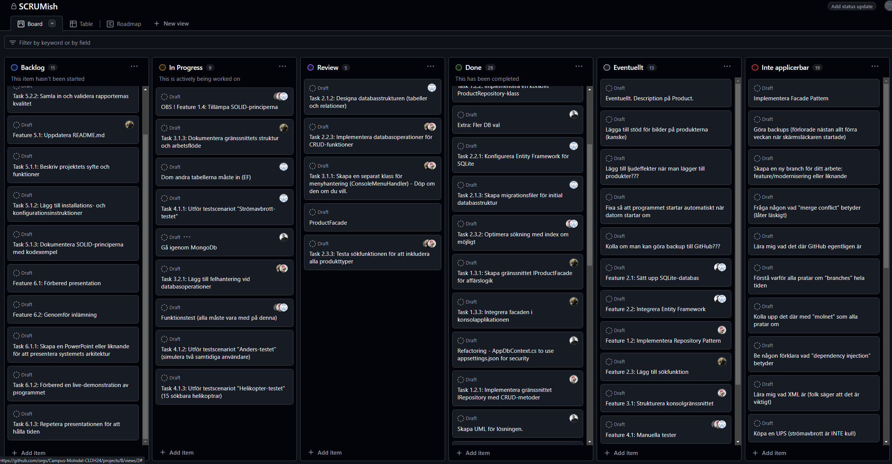

# Individuell Rapport - Niklas Häll
  
Svara på frågorna nedan och lämna in det som en del av din inlämning.
  
## Hur fungerade gruppens arbete?

### Dag för dag:
1. Fredagen den 22/11 fick vi uppgiften. Satt tillsammans ett par timmar och pratade igenom uppgiften och bestämde att Fredrik tar Lead. Jag var med på voice då jag satt i bilen, de andra deltog i större utsträckning än vad jag gjorde då.  
  
2. Under helgen pillades det en del på arbetet av två teammedlemmar, Fredrik la en hel del tid på att skapa ett SCRUM-liknande arbetssätt med Kanban-board där vi kunde följa stegen i sekvens och även se vem som hade vilka ansvarsuppgifter. Andreas tittade även på filstrukturen och en del annat.  
  
3. Måndag 25/11 så hade vi en kaotisk start, ingen visste riktigt vem som gjort vad och var vi stod, vi fick prata ihop oss under några timmar för att enas om arbetsmetod.  
Vi tog gemensamt beslutet att Fredrik skall fortsätta leda, med vissa justeringar för att förtydliga distinktionen mellan Feature och Task. Efter det var vi väldigt produktiva under eftermiddagen.
- Gjorde mycket av Epic/Features 1-3 enligt den bifogade backlog.md
- Kom till implementation av Entity Framework  
  
4. Tisdag 26/11 - Var jag tvungen att vara frånvarande, förskolan var stängd för planeringsdag och frun bortrest. Gruppen jobbade vidare och gjorde en hel del helt utan mig.  
  
5. Onsdag 27/11 - Jag var igång tidigt, men hade en stor uppförsbacke när jag missat dagen innan. Nu satt gruppen och väntade på att jag och Megan skulle implementera CRUD och sök, men jag behövde lägga tid på att läsa igenom koden först.  
- Fick lägga fyra timmar bara för att få Database-path att fungera. Vi jobbar alla i gruppen i olika IDEer och jag som använder Visual Studio 2022 hade problem med att .sln (Solution)-filen inte låg i en lägre nivå i en rotfolder. Till slut löste jag det genom att få till denna kod:
```cs
        private SQLiteDbContext()
        {
            var configuration = new ConfigurationBuilder()
                .SetBasePath(AppDomain.CurrentDomain.BaseDirectory)
                .AddJsonFile("appsettings.json", optional: false, reloadOnChange: true)
                .Build();
```
- Det blir lite som en kopia på måndagen, efter mycket strul på förmiddagen så blir eftermiddagen väldigt produktiv. Jag och Megan parprogrammerade med delad skärm och körde CRUD-funktionerna i menyn.
- På kvällen och långt in på natten satt vi flera stycken och kodade, det Megan och jag påbörjat avslutade jag (minus sök-funktionen). Den kvällen hade vi en halvstor merge-konflikt som jag hanterade via Bash/VS2022.

6. Torsdag 28/11 börjar återigen med soppa. Återkommande tema här: vi är produktiva långt in på kvällarna men jobbar med lokala grejer som sedan får konflikter för de andra som måste hanteras på morgonen. Nu hade vi problem med att vi hade delat ett ensamt Repository in i två (SQLiteRepository + MongoDBRepository).
- Vi slog först ihop dem två igen i en ensam Repository, men efter att vi sett över koden och de olika konflikterna som uppstår så valde vi att köra på två Repositories. Det blev lite städjobb. Vi löste detta snyggt via voice.
- Dagen spenderas i voice men vi jobbar i par/solo på att lösa olika problem som vi assignats i vår kanban/scrum-tavla. Gemensamt identifierar vi många av dem och löser dem bit för bit. Frustrerande men produktiv dag. Vi ligger bra till tidsmässigt.
- Andreas lägger mycket fokus på EF/migrationen, Fredrik på MongoDB och Docker Compose, Megan och Niklas på CRUD- och menyfunktionerna. Megan tittar på Index. Vi har en plan.

7. Fredag 29/11 börjar återigen uselt för min del: sonen är magsjuk och hemma från förskolan. Kan inte sitta vid datorn när sonen behöver mig, men lyckas slinka in några timmar under dagen.
- Vi har haft en massiv overhaul av Context-filerna, de var lite röriga, och då har tyvärr min path-lösning (koden jag la in under punkt 5) försvunnit. Jag hittar inte lösningen jag hade tidigare så lägger två timmar på att lösa detta - igen.
- Megan drabbas av pathing issues med, hennes databas försvinner. Kanske relaterat till mitt problem som jag just nämnde. Allting hamnar in bin-foldern. Det är definitivt relaterat till att .sln ligger i rotfoldern, den skall ligga ett steg ut..
- Fredrik fixar en Singleton-lösning, jag implementerar så Update återanvänder Search-koden och så lägger jag till ConsoleHelper för att få loss metoder ur MenuDb och MenuCrud. Lyckas återanvända Andreas snygga färg-kod för konsolloutputen i en metod i ConsoleHelper. Produktiv kväll/natt! Nu är vi inne på att göra programmet snyggare, all grundfunktion är där. Vi har ibland sönder saker när vi lägger till, men löser det snyggt. Alla jobbar hårt efter sina förutsättningar.

8. Lördag 30/11 sitter jag 00-02 och städar koden. Tar bort överflödiga kommentarer. Ser till att alla printouts är på svenska men alla kommentarer och variabelnamn är på engelska. Lyckas refaktorera ut en hel del kod som är duplicerad och hittar lite felstavade namespace och onödiga usings.
- Efter att ha spenderat dagen med familjen så använder jag kvällen till detta: uppdaterar README.md för att lägga gruppens dokumentation, medan Megan har kört på och filat på några detaljer som strular och sedan kommer Andreas in och kör vidare på samma grejer på kvällen.

### Summering / Att ta med sig:

#### Bra skit:

- Vi hade morgonmöte varje dag vid 09 där vi stämde av. Skitbra!  
  
- Vi hade ett grymt SCRUMish-kanban-board som Fredrik la upp, baserad på backlog.md


  
- Alla arbetade hårt, efter sina egna förutsättningar. De som missade dagtid pga händelser iRL, de jobbade ofta långt in på natten.  
  
- Att göra den här typen av grupparbete har varit oerhört lärorikt. Läsa andras kod. Par-programmera. Jobba i team. Planera ihop. Lösa problem vi ställer till för varandra. Lösa problem mellan IDEer och olika plattformar. Lösa frustration internt inom teamet när problem uppstår. Har lärt mig mer på en vecka än under kursen totalt än så länge. Fantastiskt kul!  

- Det här är första gången det känns som vi simulerar verkliga problem. Jobba i kod som inte har en bra struktur. Refaktorera. Jobba i team. Lösa problem. Synka mellan teammedlemmar. Läsa andras kod. Jobba i branches. Detta känns viktigt. Mer av det.  

#### Mindre bra skit och/eller problem:

- Även om vi synkade arbetsuppgifter så blev det lite för spretigt, när vi körde långa pass in på nätterna så började vi pilla på varandras grejer och då ställde vi ofta till det. Det blev till att städa varje förmiddag efter gårdagens produktiva rusher.  
  
- För mig personligen/tidsaspekten: Att få denna uppgift en vecka innan inlämning, just som vi har ett kaotiskt privatliv (som dessutom varit planerat sedan i somras, så före kursstart), det var jobbigt och gjorde att jag jobbade på nätterna istället för att sova. Jag brukar jobba 07-16:30 och ser till att sova. Nu gick inte det. Jag blev dessutom en belastning för mitt team pga detta, som jag tyvärr inte kunde påverka. Lösning: grupparbeten skall kanske lämnas ut med mer än en veckas varsel?  
  
- För mig personligen/mappstrukturen med .sln-filen: Enligt vår grupp så jobbade vi ifrån den mappstruktur som vi fått i uppgiften. Jag vet inte det är för att projektet startades i en annan IDE än VS2022, eller om det är skapat med valet "lägg solution och projekt i samma directory", men att ha .sln-filen i rotfoldern skapar massive problem med pathing for VS2022-användare! Jag har lagt så mycket tid på att felsöka detta, det är ett välkänt och vanligt problem. Vi bör försöka hålla VS2022-struktur på våra projekt så långt vi kan? Det är ändå standard-IDE från MS för .NET/C#..
  
## Beskriv gruppens databasimplementation

Jag skrev just gruppens dokumentation i README.md (det var min roll att köra dokumentationen) så det känns nästan fånigt att repetera den. Men jag kör en väääldigt kort summering:  
  
Vi följde krav-specen från "Henrik". En SQLite-databas och en MongoDB.  
  
SQLite är en relationsdatabas med tre tables (just nu, vi har pratat om att utöka den). Products, Orders och OrderItems. Det räcker för kundens kravspec om produktdatabas och CRUD-operationer, men vi vill ha mer.

MongoDB är en dokumentdatabas med ett Product-table.

Vi har gläntat på dörren för att göra det lätt att implementera fler databastabeller och-/eller anslutningar (API, moln, etc).
  
## Vilka SOLID-principer implementerade ni och hur?

Jag är så nöjd med min summering i README.md att jag tänker vara riktigt ful och bara kopiera den hit (jag har ändå skrivit det så varför göra jobbet två gånger?) -

- SOLID har fem grundprinciper som alla motsvarar en bokstav i SOLID-nyckelordet:
  
- S: Single Responsibility Principle (SRP): Varje klass har ett enda ansvar
- Exempel: MenuCrud ansvarar bara för CRUD-operationer i användarmenyn och inget annat.
```cs
internal class MenuCrud
{
    private readonly IProductFacade _currentFacade;

    public MenuCrud(IProductFacade currentFacade)
    {
        _currentFacade = currentFacade ?? throw new ArgumentNullException(nameof(currentFacade));
    }

    internal async Task ShowMenu()
    {
        // Endast ansvar för CRUD-relaterad interaktion
        await AddProduct();
        await UpdateProduct();
    }
}
```
  
- O: Open/Closed Principle (OCP): Klasser skall vara öppna för utbyggnad, men stängd för förändring
- Exempel: IRepository<T> kan utökas utan att ändra själva interfacet. Skall vi lägga till t ex en datakälla (Azure SQL) så kan vi implementera ett nytt Repository utan att ändra befintlig kod.
```cs
public class SQLiteRepository : IRepository<Product>
{
    public async Task<IEnumerable<Product>> GetAllAsync(Expression<Func<Product, bool>> predicate)
    {
        return await _dbSet.Where(predicate).ToListAsync();
    }
}
```
  
- L: Liskov Substitution Principle (LSP): Objekt av en basklass skall kunna ersättas med objekt av dess subklass utan att bryta funktionaliteten
- Exempel: IProductFacade används oavsett om implementationen är SQLite eller MongoDB.
```cs
var sqliteFacade = new ProductFacade(new SQLiteRepository(SQLiteDbContext.Instance));
var mongoFacade = new ProductFacade(new MongoRepository(MongoDbContext.Instance("connectionString", "dbName")));
```
  
- I: Interface Segregation Principle (ISP): Klasser skall inte tvingas implementera metoder de inte använder
- Exempel: IProductFacade definierar endast de metoder som behövs, utan att lägga till onödiga funktioner.
```cs
internal interface IProductFacade
{
    Task CreateProductAsync(string productName, int productQuantity, decimal productPrice, string category);
    Task DeleteProductAsync(int productId);
    Task UpdateProductAsync(Product product);
    Task<IEnumerable<Product>> GetAllProductsAsync();
}
```

- D: Dependency Inversion Principle (DIP): Moduler på hög nivå skall inte bero på moduler på låg nivå, båda skall bero på abstraktioner
- Exempel: MenuCrud och MenuDb använder IProductFacade, de kopplar inte direkt till SQLite/MongoRepository.
```cs
public class MenuDb
{
    private readonly IProductFacade _sqliteFacade;
    private readonly IProductFacade _mongoFacade;

    public MenuDb(IProductFacade sqliteFacade, IProductFacade mongoFacade)
    {
        _sqliteFacade = sqliteFacade;
        _mongoFacade = mongoFacade;
    }

    public async Task ShowMainMenuAsync()
    {
        var menuSQLite = new MenuCrud(_sqliteFacade, _sqliteFacade, _mongoFacade);
        await menuSQLite.ShowMenu();
    }
}
```
  
## Vilka patterns använde ni och varför?
  
Även det har jag nyss skrivit i README.md.. kopierar in det här med:

### Patterns

#### 1. Repository Pattern och Interfaces    
- Repository fungerar som en mellanstation, vi kan isolera dataåkomstlogiken (t ex CRUD) från affärslogiken.
- Detta mönster gör det lättare att testa affärslogiken eftersom datakällan (t ex databasen) kan bytas ut utan att ändra applikationskoden.
- Det är inte bara säkrare, det gör det även enklare att byta mellan datakällor. Perfekt i vårt databasprojekt. Kodexempel:
```cs
public interface IRepository<T> where T : class
{
    Task AddAsync(T entity); 
    Task UpdateAsync(T entity);
    Task DeleteAsync(int id);
    Task<IEnumerable<T>> SearchAsync(Expression<Func<T, bool>> predicate); 
    Task<IEnumerable<T>> GetAllAsync(Expression<Func<T, bool>> predicate);
    Task<T?> GetByIdAsync(int id);
    Task SaveChangesAsync(); 
}
```
Ovanstående är definitionen av Interfacet, vi implementerar sedan det i Repository:
```cs
public async Task<IEnumerable<Product>> GetAllAsync(Expression<Func<Product, bool>> predicate)
{
    return await _dbSet.Where(predicate).ToListAsync();
}
```
#### 2. Facade Pattern  
- Fasaden ger oss en enhetlig gränssnittsnivå som sedan kan användas av flera subsystems.
- Genom fasad-implementationen kan vi byta implementationsdetaljer utan att påverka användarkoden. Snarlikt Repository, fast i business-logiken istället för affärslogiken.
- Kodexempel av definitionen:
```cs
internal interface IProductFacade
{
    Task CreateProductAsync(string productName, int productQuantity, decimal productPrice, string category);
    Task DeleteProductAsync(int productId);
    Task UpdateProductAsync(Product product);
    Task<IEnumerable<Product>> GetAllProductsAsync();
}
```
Den implementeras sedan på detta vis:
```cs
public async Task<IEnumerable<Product>> SearchProductsAsync(string searchTerm)
{
    return await _repository.SearchAsync(p =>
        p.Name.ToLower().Contains(searchTerm.ToLower()) ||
        (p.Category != null && p.Category.ToLower().Contains(searchTerm.ToLower())));
}
```
#### 3. Singleton Pattern  
- Vinsten med att använda singleton i detta fall är att vi säkerställer att endast en instans av en klass skapas under applikationens livstid. Det är ett utmärkt val vid databasanslutningar. Vi kan se exempel på det i SQLiteDbContext.cs och i MongoDbContext.cs:
```cs
private static readonly Lazy<SQLiteDbContext> _lazyInstance = new(() => new SQLiteDbContext());
public static SQLiteDbContext Instance => _lazyInstance.Value;
```
#### 4. Factory Pattern  
- Vi använder det för att skapa objekt men utan att exponera logiken bakom.
- Koden blir mer modulär då vi kan skapa underlätta skapandet av komplexa beroenden (som våra Context-filer).
- Kodexempel när vi skapar IProductFacade:
```cs
private static IProductFacade CreateSqLiteFacade()
{
    var sqliteRepository = new SQLiteRepository(SQLiteDbContext.Instance);
    return new ProductFacade(sqliteRepository);
}
```

### Design-tekniker

#### 5. Entity Framework (EF)  
- EF är en ORM (Object-Relational Mapper), ett ramverk som hjälper oss bygga t ex modeller för att hantera databasen.
- EF som ramverk har många verktyg implementerade i NuGet-paketet, de hjälper oss t ex att hantera låv-nivå-operationer (som att översätta modeller, skapa SQL-kommandon, etc).
- Kodexempel nedan där vi använder modelBuilder för att hantera databastabellerna "Products" och "OrderItem":
```cs
protected override void OnModelCreating(ModelBuilder modelBuilder)
{
    modelBuilder.Entity<Product>().ToTable("Products");

    modelBuilder.Entity<Product>()
        .HasIndex(p => p.Name)
        .HasDatabaseName("IX_Products_Name");

    modelBuilder.Entity<OrderItem>()
        .HasOne(oi => oi.Product)
        .WithMany()
        .HasForeignKey(oi => oi.ProductId);
}
```

#### 6. Dependency Injection (DI)  
- Vi använder oss av DI. Det betyder helt enkelt att vi parametriserar värden istället för att hårdkoda dem. Vi kan till exempel skicka SQL-kod som strängar.
- Det gör kodtrafik mer säker och även lättare att lägga templates för att köra mellan olika databassystem (dock har det inte stöd för MongoDB, men däremot SQL-Molntjänster om kunden väljer att utveckla dit i framtiden).
- DI-verktyg ingår i Entity Framework, oerhört praktiskt när vi redan kör EF.
- Rent praktiskt går det till genom att klasser tar emot sina beroenden genom konstruktorer. Kodexempel nedan:
```cs
public MenuCrud(IProductFacade currentFacade, IProductFacade sqliteFacade, IProductFacade mongoFacade)
{
    _currentFacade = currentFacade ?? throw new ArgumentNullException(nameof(currentFacade));
    this.sqliteFacade = sqliteFacade ?? throw new ArgumentNullException(nameof(sqliteFacade));
    this.mongoFacade = mongoFacade ?? throw new ArgumentNullException(nameof(mongoFacade));
}
```

#### 7. Separations of Concerns (SoC)   
- SoC är en grundbult när det gäller kodprinciper, den är relaterad till både Clean Code-filosofin och SOLID-principerna. Enligt dess princip skall varje applikation delas upp i separata moduler eller lager, där varje modul har sitt eget ansvarsområde.
- Exempel från denna applikation: Vi har UI-foldern med MenuDb, MenuCrud och ConsoleHelper som stöd för att hantera användarinteraktion och presentation.
- Olika affärsområden har brutits ut i separata element: ProductFacade, våra Repositories, etc.
- Vinsten med arbeta modulärt och bryta ut koden i separata moduler är inte bara för att göra koden mer läsbar, den är även lättare att utvecklas, tas bort, testas, och underlättare även om vi vill återanvända kod.
- Vill bara notera skillnaden mellan SRP i SOLID-principen jämfört med SoC: Båda delar upp kodansvar, men SRP har fokus på en enskild klass eller modul medans SoC handlar om hela applikations-strukturen.

#### 8. Kunden skall kunna stänga av programmet utan att förlora data

Vi har tre primära säkerhetsfunktioner på plats för att förhindra dataförlust eller korrupt data:
  
1. Dels lagras data i en databas nu, applikationen är fristående och datan lagras inte i denna applikation. Det går utmärkt att stänga av den och datan lagras i databasens minne.
  
2. Dels använder vi async för att säkerställa att operationer genomförst i rätt ordning; vi kan ta ett exempel med där en produkt läggs till:
```cs
public async Task AddAsync(Product entity)
{
    if (!await _dbSet.AnyAsync(p => p.Name == entity.Name))
    {
        await _dbSet.AddAsync(entity); // Async operation säkerställer att tillägget inte avbryts mitt i processen
        await _context.SaveChangesAsync(); // Ändringarna sparas först efter att allt är korrekt genomfört
    }
    else
    {
        Console.WriteLine("Produkten finns redan i databasen.");
    }
}
```
Vad som händer ovan: Notera hur varje 'Async' avslutas med en 'await'. Det betyder helt enkelt att koden väntar vid await tills processen ovan har genomförts. I det här kodexemplet så sparas inte datan genom SaveChangesAsync förrän stegen innan genomförts. 
   
3. Transaktioner är en annan teknisk lösning för att säkerställa dataintegritet och atomicitet, de är lite svårare att illustrera i kod, vi utvecklar nedan:
```cs
public async Task UpdateProductAsync(Product product)
{
    using var transaction = await _context.Database.BeginTransactionAsync(); // Börja transaktion
    try
    {
        var existingProduct = await _repository.GetByIdAsync(product.Id);
        if (existingProduct == null)
        {
            throw new InvalidOperationException("Produkten kunde inte hittas.");
        }

        existingProduct.Name = product.Name;
        existingProduct.Price = product.Price;
        existingProduct.Stock = product.Stock;

        _context.Products.Update(existingProduct); // Uppdatera produkten
        await _context.SaveChangesAsync(); // Förbered att spara ändringen

        await transaction.CommitAsync(); // Spara ändringen först när allt är korrekt
    }
    catch (Exception ex)
    {
        await transaction.RollbackAsync(); // Återställ ändringar vid fel
        Console.WriteLine($"Ett fel inträffade: {ex.Message}");
    }
}
```
Vad som händer ovan: Vi ser att SaveChangesAsync förbereder för att spara uppdateringen, men CommitAsync kör inte förrän stegen innan är kompletta. Transaction är en utmärkt lösning när vi kör flera steg efter varandra där hela kedjan är beroende av varandra.  
  
I detta fall, vad hade hänt om vi kört Update -> Save Changes, sedan Commit -> Save Changes, men tappat anslutning mellan Update->Save och Commit->Save? Vi hade kunnat uppdatera en beställning, men den hade inte Commitat. När vi startar om hade vi antingen helt saknat Commit-steget eller så hade hela processen startat om med en uppdatering av en uppdatering. Oerhört allvarligt! Transaction skyddar applikationen.
  
## Vilka tekniska utmaningar stötte ni på och hur löste ni dem?

Har nämnt en del av det redan när jag skrev "dagboken" om gruppens arbete, men kan utveckla det lite:

#### .sln-filen och plattforms-skillnader:
Att den låg i fel position ställde till det för mig personligen, och även för Megan när koden justerades vid något tillfälle (då fick hon plötsligt databasen flyttade till bin-foldern).  
  
Vi sitter på olika plattformar. Mac/VSCode, Windows/Rider, Windows/VS2022 etc. Det skapar tekniska utmaningar i strukturen på koden. Vi löste det genom att försöka förstå det underliggande problemet: .sln styr var filer hamnar för VS2022 medans andra IDEr är smartare. Default för databaser är bin-foldern.
  
#### Timing av implementationer (beroenden):
Vissa funktioner var beroende av varandra, vi försökte följa backlog.md för den hade ett förnämligt upplägg. Men eftersom vi delade upp arbetet mellan oss så hände det att vi satt fast i olika steg före-/efter varandra. Ibland ställde det även till det tekniskt för varandra. Ett sätt vi hanterade detta var genom våra "morgonmöten" vid 09, vi körde oftast 09-12 tillsammans varje dag. Det betydde mycket.  

#### Entity Framework och migration:
Denna hade tre av oss försökt oss på solo och haft mer eller mindre lycka med. Vi har tittat ytterst lite på detta på lektionstid. Andreas ville ta den punkten för han hade inte provat den. Att få till databasmigrationen samtidigt som vi jobbar på databasen och har problem med paths var inte helt lätt. Sedan av olika skäl så har olika personer tittat på det under programmets utvecklingsgång. Hur vi löste det? Kommunikation och klassisk felsökning.  
  
#### Apropå klassisk felsökning:
Vi körde faktiskt felsökningsträning Megan och jag när vi parprogrammerade. Hon sökte i Microsoft Learn (dokumentationen) medan jag följde felkoder och läste informationen inne i IDEn medan vi kodade. AI-hjälpmedel kom i andra hand (men användes med). Det var riktigt bra att köra i team för att lösa vanliga mindre kodproblem, vi kompletterar varandra och ser olika saker.  
  
#### MongoDB och Docker Container:
Hur löser vi en MongoDB utan att ha den hostad? Fredrik hade en grym idé, han använde Docker Container och såg till att vi hade en MongoDB att jobba med.  
  
## Hur planerade du ditt arbete?

Startade varje dag med att läsa på vad de andra gjort, kollade vårt Kanban-SCRUMish-board och kommunicerade med mina teammedlemmar om vad de behövde för att komma vidare/vad de jobbade på.
  
Oftast var det lättast att ta ett mindre sidoprojekt som var ett beroende för någon annan, men som inte pillade på viktiga kod-element (SQLiteDbContext och MongoDbContext var känsliga filer!! :o så kan man säga.. det har varit mycket pillande på dem).  

## Vilka delar gjorde du?

Har hoppat lite fram och åter mellan element jag gjort, ibland har vi byggt från grunden, ibland har vi städat i andras kod. Men någonting sådant här:
  
- Tillsammans med Megan la jag grunden för CRUD. Det har varit många iterationer efter det, men vi byggde grunden tillsammans.  
  
- Jag skapade switch-menyn som Andreas senare konverterade till MenuCrud. Han la till färgerna och sedan gick jag in och pillade igen och bröt loss metoder och skapade ConsoleHelper. Jag gjorde funktionerna, han gjorde utseendet och han bröt lös MenuDb.  
  
- README.md har jag gjort 95% av, Fredrik har lagt Docker Compose-biten och UML-.
  
- Jag städade koden från överflödiga kommentarer, fixade felaktigt namngivna namespace och/eller usings, såg till att konsekvent använda engelska i kodnamn + kommentarer, men svenska i konsol-printouts. I samma veva gjorde jag sakar som detta:  
```cs
    public async Task<IEnumerable<Product>> GetAllAsync()
    {
        return await _dbSet.ToListAsync();
    }

    public async Task<IEnumerable<Product>> GetAllAsync(Func<Product, bool> predicate)
    {
        return await Task.FromResult(_dbSet.Where(predicate).AsEnumerable());
    }

    public async Task<IEnumerable<Product>> GetAllAsync(Expression<Func<Product, bool>> predicate)
    {
        return await _dbSet.Where(predicate).ToListAsync();
    }
```
Det var kod som låg i både SQLite- och MongoDb-Repositories. Justerade till:
```cs
    public async Task<IEnumerable<Product>> GetAllAsync(Expression<Func<Product, bool>> predicate)
    {
        return await _dbSet.Where(predicate).ToListAsync();
    }
```
  
- Jag fixade också så att Update-funktionen i Crud implementerade Search-funktionen, efter det så återanvände vi både kod från Search och kunde samtidigt söka bland våra produkter när vi ville uppdatera dem.  
Tänkte: "vem vet vilket produktID någonting har? Och tänk om flera produkter heter samma sak?". Så nu kan vi söka t ex "Helikopter" och då får vi alla helikoptrar i databasen, med deras ID och lagersaldo. Därifrån kan vi uppdatera direkt på ett ID. Den tyckte jag ger både UX-win plus vi återanvänder kod.
   
- Sedan har jag lagt väldigt mycket tid på att korrigera småsaker, och en stor: pathingen och .sln-problematiken. Totalt har jag lagt minst sex timmar bara på att lösa pathingen. Jag har testat mycket av de andras kod och tittat om det blir fel i min IDE/plattform, i så fall har jag letat alternativa lösningar.  
  
## Vilka utmaningar stötte du på och hur löste du dem?

Nu har vi nämnt dem massor av gånger, men om vi hoppar över det tekniska (så slipper vi en repetition):

- En stor utmaning var starten på projektet. Det var känsligt och rörigt första måndag morgon när två av fyra har lagt en massa tid på projektet men har dragit iväg åt olika håll med olika idéer. Som team löste vi det genom att prata ut och cementera våra roller. Jag är imponerad över alla fyra som löste det snyggt.  
  
- Den största utmaningen tekniskt var och .sln-filen.  

- Den största personliga utmaningen var mitt minst sagt hektiska liv utanför detta projekt, som skapade en väldigt svår sits. Stängd förskola, magsjukt barn, fru bortrest, kontraktskrivning på försäljning av hus, husvisning, skjutsa familjen medan fruns bil är på service. Allting inom fem dagar. Kaos.  
Löste det genom att kommunicera väldigt tydligt med mitt team att dessa förutsättningar var svåra men att jag skulle lägga mina timmar, även om det skulle bli svårt att sitta tillsammans samtidigt. Försökte delta via voice när jag inte kunde sitta vid datorn (måndagen).  
  
## Vad skulle du göra annorlunda nästa gång?

  Kollat med teamet om vi inte kunde ha brutit ner projektet i flera små bitar än vad vi gjorde. Så vi inte riskerade pilla på varandras filer medan någon jobbade på dem.
    
Vi kanske skulle ha identifierat vilka känsliga filer som fanns och fokuserat på att göra dem tillsammans tidigare. Vi visste om några, men DbContext var en sådan aspekt som blev omskriven många många gånger.  