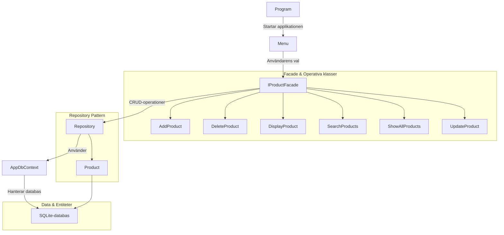
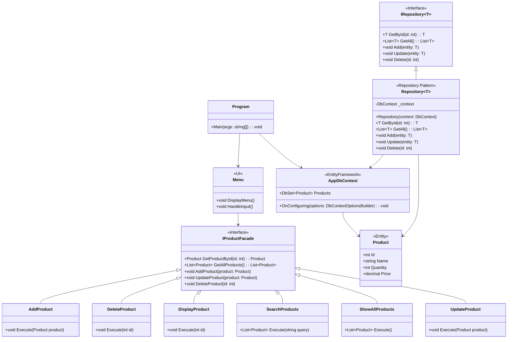
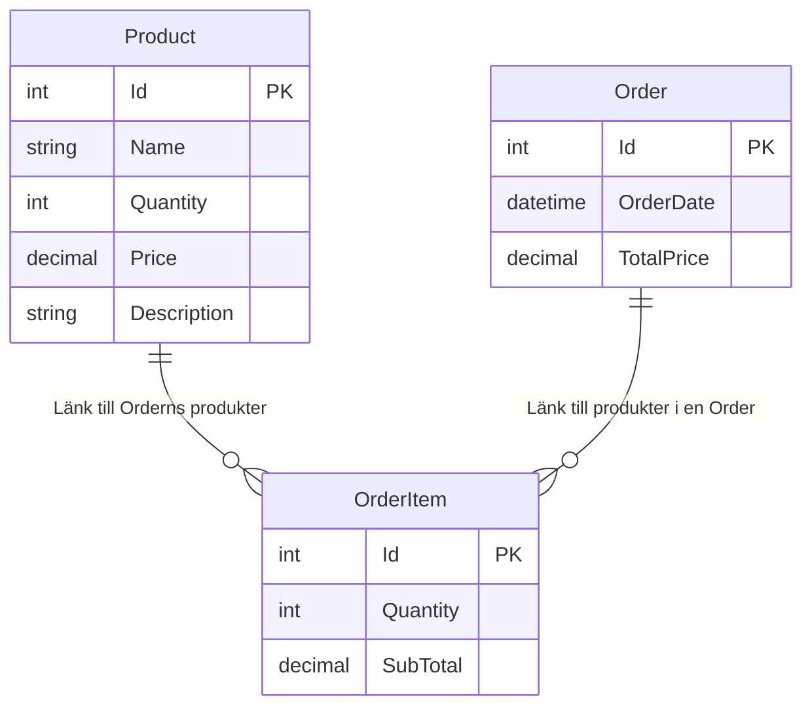


### Beskrivning av diagrammet:
1. **`Menu` klass**: UI-menyn som hanterar användarinteraktion i konsolen.
2. **`AddProduct`, `DeleteProduct`, etc.**: Visar operationerna under Facade och hur de utför specifika CRUD-funktioner.
3. **`IProductFacade`**: Är en nyckelkomponent som centraliserar alla metoder för produktåtkomst och manipulation.
4. **Program**: Central klass som kopplar UI (`Menu`) och databasen.

### UML-diagram Flowchart.

### UML-diagram Klassdiagram.

### ER-diagram Entitetsrelation.
