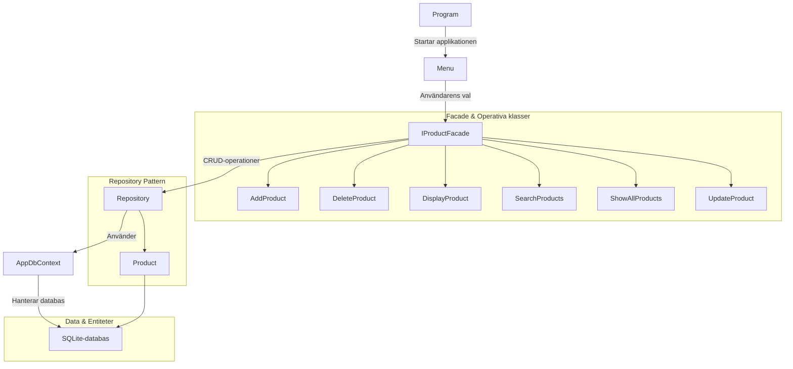
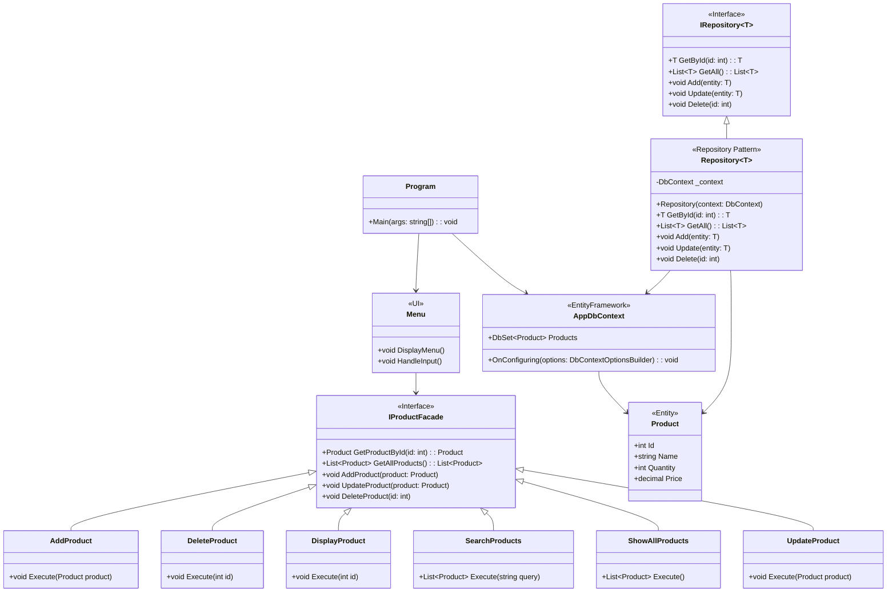
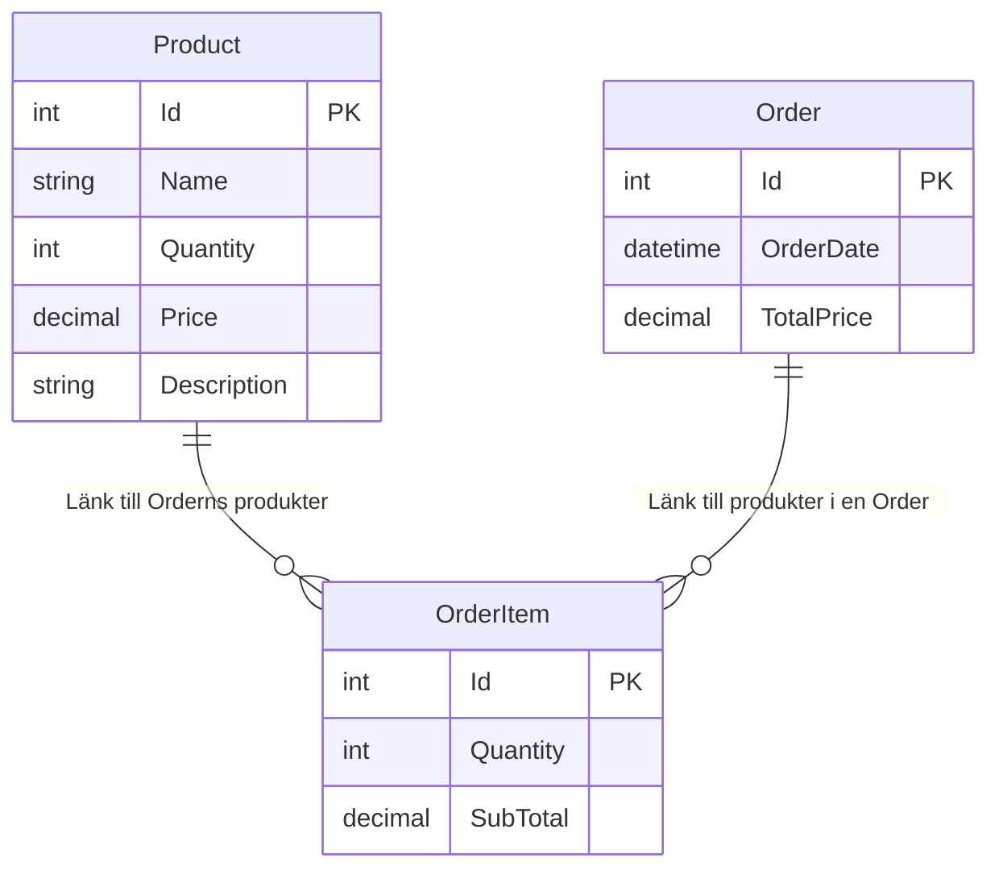

# Henriks Hobbylager


  
### Kort beskrivning av projektet
    
Kunden HH har idag ett enklare lagerhanteringsprogram. Han har ett ökande behov av att få till stånd en robustare applikation som matchar kundens växande företag.

Kunden tog därför kontakt med oss på 31337, då överlämnades en produktbeskrivning med vissa specifika önskemål:
- Applikationen skall implementera viss arkitektur (Repository- samt Facade Pattern).
- Interfaces skall användas och konsolgränssnittet behållas
- Spara all data i både en SQLite-databas samt en MongoDB-databas
- SOLID och Clean Code-principer skall appliceras på koden
- Kunna stänga av programmet (eller förlora anslutning) utan att förlora data
- Koden skall vara strukturerad så den är förberedd för framtida förbättringar (t ex implementation av moln-databas)
  
## Installationsinstruktioner

### Projektets repository hittas på GitHub:
```bash
git clone https://github.com/Campus-Molndal-CLOH24/OopAdv_31337_Lagershop.git
```
  
## Hur programmet körs
  
### Funktioner för att styra programmet
- Programmet följer kundens krav-spec i form av att vara en konsollapplikation
- Det finns två huvudmenyer som kunden kan arbeta i: Vid startup väljer kunden vilken databas hen vill arbeta i, sedan följs det av en meny som hanterar grundläggande CRUD-funktioner
- Vissa val har flera funktioner i ett. Exempelvis "Uppdatera en produkt" startar med en enklare val: sök efter produkt-id eller fri namn? Söker användaren efter produktnamn så återanvänds samma kod som används i "Sök igenom produkterna".
- På så vis är programmet intuitivt, bara två egentliga menyer, men ändå finns mer komplexa tekniska lösningar och användarfunktioner.

## Eventuella konfigurationsinställningar

### Docker Composer
  - Kräver att Docker Composer och Docker är installerat.
  - Starta MongoDB inne från projektet där Docker-Compose.yml ligger genom Docker Desktop terminalen, skärmbild 
    ligger i mappen "docs/docker".
```bash
  docker-compose up -d   
```

## Patterns och tekniska lösningar

### Patterns

#### 1. Repository Pattern och Interfaces    
- Repository fungerar som en mellanstation, vi kan isolera dataåkomstlogiken (t ex CRUD) från affärslogiken.
- Detta mönster gör det lättare att testa affärslogiken eftersom datakällan (t ex databasen) kan bytas ut utan att ändra applikationskoden.
- Det är inte bara säkrare, det gör det även enklare att byta mellan datakällor. Perfekt i vårt databasprojekt. Kodexempel:
```cs
public interface IRepository<T> where T : class
{
    Task AddAsync(T entity); 
    Task UpdateAsync(T entity);
    Task DeleteAsync(int id);
    Task<IEnumerable<T>> SearchAsync(Expression<Func<T, bool>> predicate); 
    Task<IEnumerable<T>> GetAllAsync(Expression<Func<T, bool>> predicate);
    Task<T?> GetByIdAsync(int id);
    Task SaveChangesAsync(); 
}
```
Ovanstående är definitionen av Interfacet, vi implementerar sedan det i Repository:
```cs
public async Task<IEnumerable<Product>> GetAllAsync(Expression<Func<Product, bool>> predicate)
{
    return await _dbSet.Where(predicate).ToListAsync();
}
```
#### 2. Facade Pattern  
- Fasaden ger oss en enhetlig gränssnittsnivå som sedan kan användas av flera subsystems.
- Genom fasad-implementationen kan vi byta implementationsdetaljer utan att påverka användarkoden. Snarlikt Repository, fast i business-logiken istället för affärslogiken.
- Kodexempel av definitionen:
```cs
internal interface IProductFacade
{
    Task CreateProductAsync(string productName, int productQuantity, decimal productPrice, string category);
    Task DeleteProductAsync(int productId);
    Task UpdateProductAsync(Product product);
    Task<IEnumerable<Product>> GetAllProductsAsync();
}
```
Den implementeras sedan på detta vis:
```cs
public async Task<IEnumerable<Product>> SearchProductsAsync(string searchTerm)
{
    return await _repository.SearchAsync(p =>
        p.Name.ToLower().Contains(searchTerm.ToLower()) ||
        (p.Category != null && p.Category.ToLower().Contains(searchTerm.ToLower())));
}
```
#### 3. Singleton Pattern  
- Vinsten med att använda singleton i detta fall är att vi säkerställer att endast en instans av en klass skapas under applikationens livstid. Det är ett utmärkt val vid databasanslutningar. Vi kan se exempel på det i SQLiteDbContext.cs och i MongoDbContext.cs:
```cs
private static readonly Lazy<SQLiteDbContext> _lazyInstance = new(() => new SQLiteDbContext());
public static SQLiteDbContext Instance => _lazyInstance.Value;
```
#### 4. Factory Pattern  
- Vi använder det för att skapa objekt men utan att exponera logiken bakom.
- Koden blir mer modulär då vi kan skapa underlätta skapandet av komplexa beroenden (som våra Context-filer).
- Kodexempel när vi skapar IProductFacade:
```cs
private static IProductFacade CreateSqLiteFacade()
{
    var sqliteRepository = new SQLiteRepository(SQLiteDbContext.Instance);
    return new ProductFacade(sqliteRepository);
}
```

### Design-tekniker

#### 5. Entity Framework (EF)  
- EF är en ORM (Object-Relational Mapper), ett ramverk som hjälper oss bygga t ex modeller för att hantera databasen.
- EF som ramverk har många verktyg implementerade i NuGet-paketet, de hjälper oss t ex att hantera låv-nivå-operationer (som att översätta modeller, skapa SQL-kommandon, etc).
- Kodexempel nedan där vi använder modelBuilder för att hantera databastabellerna "Products" och "OrderItem":
```cs
protected override void OnModelCreating(ModelBuilder modelBuilder)
{
    modelBuilder.Entity<Product>().ToTable("Products");

    modelBuilder.Entity<Product>()
        .HasIndex(p => p.Name)
        .HasDatabaseName("IX_Products_Name");

    modelBuilder.Entity<OrderItem>()
        .HasOne(oi => oi.Product)
        .WithMany()
        .HasForeignKey(oi => oi.ProductId);
}
```

#### 6. Dependency Injection (DI)? Nja. Inversion of Control (IoC)!  
- Vi använder oss av IoC för att separera beroenden från implementationerna. Det innebär att vi explicit tillhandahåller beroenden genom att skicka in instanser till klasser som behöver dem, istället för att hårdkoda dem i klasserna själva.
- IoC förbättrar testbarhet, modularitet och minskar beroenden mellan klasser.
- Om vi i framtiden skulle använda en DI-container, skulle vi kunna automatisera den här hanteringen för ytterligare effektivitet.
- Rent praktiskt gör vi detta genom att skicka beroenden via konstruktorer. Kodexempel:
```cs
public MenuCrud(IProductFacade currentFacade, IProductFacade sqliteFacade, IProductFacade mongoFacade)
{
    _currentFacade = currentFacade ?? throw new ArgumentNullException(nameof(currentFacade));
    this.sqliteFacade = sqliteFacade ?? throw new ArgumentNullException(nameof(sqliteFacade));
    this.mongoFacade = mongoFacade ?? throw new ArgumentNullException(nameof(mongoFacade));
}
```
- Vad saknas för att detta skulle bli DI rent specifikt (mer än att fungera ungefär som DI)? Vi hade behövt använda en DI-container (t ex Microsoft.Extensions.DependencyInjection) och låta den ansvara för att skapa och injicera instanser. Vi hade inte specifikt behövt skapa new MenuDB, DI-containern hade automatiskt gjort det när vi begär MenuDB i koden. Kodexempel:
```cs
services.AddScoped<IProductFacade, ProductFacade>();
services.AddScoped<MenuDb>();
```
- Niklas skrev en dokumentation om DI initialt för han trodde att det räckte med parametriserad injektion för att det skall vara DI, men Megan pekade (rätt!) ut att det var IoC, inte DI. Niklas har korrigerat denna dokumentation i efterhand. Vi hade säkert tittat på att implementera detta om vi inte hade hittat det i sista timmen. Bra läxa - snyggt Megan!

#### 7. SOLID-principen och denna applikation

- SOLID har fem grundprinciper som alla motsvarar en bokstav i SOLID-nyckelordet:
  
- S: Single Responsibility Principle (SRP): Varje klass har ett enda ansvar
- Exempel: MenuCrud ansvarar bara för CRUD-operationer i användarmenyn och inget annat.
```cs
internal class MenuCrud
{
    private readonly IProductFacade _currentFacade;

    public MenuCrud(IProductFacade currentFacade)
    {
        _currentFacade = currentFacade ?? throw new ArgumentNullException(nameof(currentFacade));
    }

    internal async Task ShowMenu()
    {
        // Endast ansvar för CRUD-relaterad interaktion
        await AddProduct();
        await UpdateProduct();
    }
}
```
  
- O: Open/Closed Principle (OCP): Klasser skall vara öppna för utbyggnad, men stängd för förändring
- Exempel: IRepository<T> kan utökas utan att ändra själva interfacet. Skall vi lägga till t ex en datakälla (Azure SQL) så kan vi implementera ett nytt Repository utan att ändra befintlig kod.
```cs
public class SQLiteRepository : IRepository<Product>
{
    public async Task<IEnumerable<Product>> GetAllAsync(Expression<Func<Product, bool>> predicate)
    {
        return await _dbSet.Where(predicate).ToListAsync();
    }
}
```
  
- L: Liskov Substitution Principle (LSP): Objekt av en basklass skall kunna ersättas med objekt av dess subklass utan att bryta funktionaliteten
- Exempel: IProductFacade används oavsett om implementationen är SQLite eller MongoDB.
```cs
var sqliteFacade = new ProductFacade(new SQLiteRepository(SQLiteDbContext.Instance));
var mongoFacade = new ProductFacade(new MongoRepository(MongoDbContext.Instance("connectionString", "dbName")));
```
  
- I: Interface Segregation Principle (ISP): Klasser skall inte tvingas implementera metoder de inte använder
- Exempel: IProductFacade definierar endast de metoder som behövs, utan att lägga till onödiga funktioner.
```cs
internal interface IProductFacade
{
    Task CreateProductAsync(string productName, int productQuantity, decimal productPrice, string category);
    Task DeleteProductAsync(int productId);
    Task UpdateProductAsync(Product product);
    Task<IEnumerable<Product>> GetAllProductsAsync();
}
```

- D: Dependency Inversion Principle (DIP): Moduler på hög nivå skall inte bero på moduler på låg nivå, båda skall bero på abstraktioner
- Exempel: MenuCrud och MenuDb använder IProductFacade, de kopplar inte direkt till SQLite/MongoRepository.
```cs
public class MenuDb
{
    private readonly IProductFacade _sqliteFacade;
    private readonly IProductFacade _mongoFacade;

    public MenuDb(IProductFacade sqliteFacade, IProductFacade mongoFacade)
    {
        _sqliteFacade = sqliteFacade;
        _mongoFacade = mongoFacade;
    }

    public async Task ShowMainMenuAsync()
    {
        var menuSQLite = new MenuCrud(_sqliteFacade, _sqliteFacade, _mongoFacade);
        await menuSQLite.ShowMenu();
    }
}
```

#### 8. Separations of Concerns (SoC)   
- SoC är en grundbult när det gäller kodprinciper, den är relaterad till både Clean Code-filosofin och SOLID-principerna. Enligt dess princip skall varje applikation delas upp i separata moduler eller lager, där varje modul har sitt eget ansvarsområde.
- Exempel från denna applikation: Vi har UI-foldern med MenuDb, MenuCrud och ConsoleHelper som stöd för att hantera användarinteraktion och presentation.
- Olika affärsområden har brutits ut i separata element: ProductFacade, våra Repositories, etc.
- Vinsten med arbeta modulärt och bryta ut koden i separata moduler är inte bara för att göra koden mer läsbar, den är även lättare att utvecklas, tas bort, testas, och underlättare även om vi vill återanvända kod.
- Vill bara notera skillnaden mellan SRP i SOLID-principen jämfört med SoC: Båda delar upp kodansvar, men SRP har fokus på en enskild klass eller modul medans SoC handlar om hela applikations-strukturen.

#### 9. Kunden skall kunna stänga av programmet utan att förlora data

Vi har tre primära säkerhetsfunktioner på plats för att förhindra dataförlust eller korrupt data:
  
1. Dels lagras data i en databas nu, applikationen är fristående och datan lagras inte i denna applikation. Det går utmärkt att stänga av den och datan lagras i databasens minne.
  
2. Dels använder vi async för att säkerställa att operationer genomförst i rätt ordning; vi kan ta ett exempel med där en produkt läggs till:
```cs
public async Task AddAsync(Product entity)
{
    if (!await _dbSet.AnyAsync(p => p.Name == entity.Name))
    {
        await _dbSet.AddAsync(entity); // Async operation säkerställer att tillägget inte avbryts mitt i processen
        await _context.SaveChangesAsync(); // Ändringarna sparas först efter att allt är korrekt genomfört
    }
    else
    {
        Console.WriteLine("Produkten finns redan i databasen.");
    }
}
```
Vad som händer ovan: Notera hur varje 'Async' avslutas med en 'await'. Det betyder helt enkelt att koden väntar vid await tills processen ovan har genomförts. I det här kodexemplet så sparas inte datan genom SaveChangesAsync förrän stegen innan genomförts. 
   
3. Transaktioner är en annan teknisk lösning för att säkerställa dataintegritet och atomicitet, de är lite svårare att illustrera i kod, vi utvecklar nedan:
```cs
public async Task UpdateProductAsync(Product product)
{
    using var transaction = await _context.Database.BeginTransactionAsync(); // Börja transaktion
    try
    {
        var existingProduct = await _repository.GetByIdAsync(product.Id);
        if (existingProduct == null)
        {
            throw new InvalidOperationException("Produkten kunde inte hittas.");
        }

        existingProduct.Name = product.Name;
        existingProduct.Price = product.Price;
        existingProduct.Stock = product.Stock;

        _context.Products.Update(existingProduct); // Uppdatera produkten
        await _context.SaveChangesAsync(); // Förbered att spara ändringen

        await transaction.CommitAsync(); // Spara ändringen först när allt är korrekt
    }
    catch (Exception ex)
    {
        await transaction.RollbackAsync(); // Återställ ändringar vid fel
        Console.WriteLine($"Ett fel inträffade: {ex.Message}");
    }
}
```
Vad som händer ovan: Vi ser att SaveChangesAsync förbereder för att spara uppdateringen, men CommitAsync kör inte förrän stegen innan är kompletta. Transaction är en utmärkt lösning när vi kör flera steg efter varandra där hela kedjan är beroende av varandra.  
  
I detta fall, vad hade hänt om vi kört Update -> Save Changes, sedan Commit -> Save Changes, men tappat anslutning mellan Update->Save och Commit->Save? Vi hade kunnat uppdatera en beställning, men den hade inte Commitat. När vi startar om hade vi antingen helt saknat Commit-steget eller så hade hela processen startat om med en uppdatering av en uppdatering. Oerhört allvarligt! Transaction skyddar applikationen.
  
## Kort beskrivning av databasstrukturen

### docs/uml.md

Det finns ett markdowndokument som heter uml.md i docs-foldern som beskriver strukturen mer ingående.

#### Rent funktionellt och strukturellt

Applikationen har två olika databaser som hanterar data idag:
- SQLite
- MongoDB
  
Det är efter kundens önskemål som dessa är implementerade först. Det finns expansionsutrymme för att lägga till flera möjliga databaser i framtiden eftersom applikationen jobbar med lager och patterns (Repository och Facade). Vi kan tänka oss att kunden lätt kan lägga till exempelvis molntjänster (med tanke på EF och SQLite idag vore Azure SQL lätt att lägga till), API-integrationer eller andra NoSQL-databaser.

#### SQLite
  
- Fungerar som en enklare relationsdatabas, den har idag tre tabeller: Products, Orders och OrderItems. Produkter är den primära tabellen, de andra två är för att kunna söka data som exempelvis kundbeställningar, räkna totalpriser, subtotaler etc.
- Strukturen är skalbar och det ligger redan i backloggen idéer om att implementera kunder, användare, etc. Statistik, rabatter, det finns många fördelar med det.
  
#### MongoDB
   
- MongoDB är en dokumentdatabas, applikationen lagrar produkter som dokument i en Products-samling.
- Den är implementerad med Docker Composer för smidig containerhantering.

## Bonus: Inkluderar informationen som redan finns i uml.md
Lägger bara till de här för att vara oerhört tydlig med att det inte missas, nu när vi har det här segmentet där databasstrukturen skall presenteras:

### Beskrivning av diagrammet:
1. **`Menu` klass**: UI-menyn som hanterar användarinteraktion i konsolen.
2. **`AddProduct`, `DeleteProduct`, etc.**: Visar operationerna under Facade och hur de utför specifika CRUD-funktioner.
3. **`IProductFacade`**: Är en nyckelkomponent som centraliserar alla metoder för produktåtkomst och manipulation.
4. **Program**: Central klass som kopplar UI (`Menu`) och databasen.

### UML-diagram Flowchart.


### UML-diagram Klassdiagram.


### ER-diagram Entitetsrelation.



